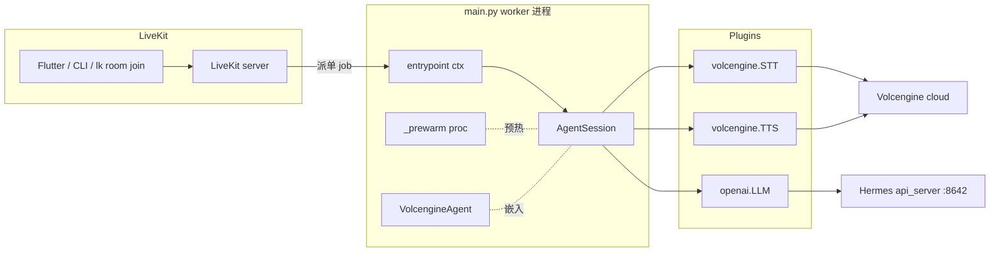

# 架构总览

OpenVox 是单 Python 进程(`apps/voice-agent/main.py`),注册成 LiveKit Agents worker。当 LiveKit 把 job 派到一个房间时,worker 给该房间建一个 `AgentSession` 并加入房间。每个 session 跑一条 STT → LLM → TTS 流水线;逐 session 的工厂函数见 [会话拼装](./session-wiring.md)。

## 整体架构 4 块图

<!-- openwiki: mermaid parse failed and this diagram was converted to a text fence so it does not break rendering. Fix the diagram source and restore the mermaid fence. Parser error: Heuristic: an unescaped angle bracket inside a label breaks rendering; rephrase the label. -->
```text
flowchart LR
    subgraph Client[Flutter 客户端]
        C[apps/voice-client<br/>iOS/Android/Web/Mac]
    end
    subgraph LiveKit[LiveKit Server]
        LK[infra/docker-compose<br/>WS :7880]
    end
    subgraph Worker[voice-agent worker]
        M[apps/voice-agent/main.py<br/>VolcengineAgent + _build_session]
    end
    subgraph Volc[Volcengine]
        STT[STT 大模型 WebSocket]
        TTS[TTS 豆包 V3 chunked HTTP]
    end
    Hermes[Hermes api_server :8642<br/>OpenAI 兼容 LLM 网关]
    C -- 音频上行 / 远端音频下行 --> LK
    LK -- 派单 job --> M
    M -- 流式 PCM --> STT
    M -- 流式 chat completions --> Hermes
    M -- 合成请求 --> TTS
    STT -- 最终识别文本 --> M
    Hermes -- 流式 delta --> M
    TTS -- 音频块 --> M
    M -- 音频块 --> LK
    LK -- 音频下行 --> C
```

> 房间名 / Agent 名 / Metadata 字段由 [跨端契约](./contracts.md) 钉住;改任何一端前先读 `shared/`。

## Worker 进程内的关键模块



`main.py` 是唯一入口。`config.py` 在模块加载时被 import 一次,暴露进程级 `Config` 单例供 `_build_session()` 消费。`scripts/start.sh` 是 wrapper,负责准备环境变量和 IPC 端口(8081)再启动 `python main.py start`。

## Worker 生命周期

1. **模块加载(`main.py` 顶层)**
   - import `config.get_config` 并调用一次(`_cfg = get_config()`)。失败(`ConfigError`、`~/.openvox/config.json` 缺失)立即抛出 —— 这是为什么 `scripts/start.sh` 在启动前先做一次 JSON 合法性检查。
   - **在任何 `AgentSession` 创建之前**安装三处 monkey-patch,详见 [模块加载时安装的 patch](#模块加载时安装的-patch)。
   - 用 `logging.basicConfig` + `force=True` 配置日志,避免 LiveKit CLI 的 JSON handler 双打印。
2. **`WorkerOptions(agent_name=...)` 注册**(`if __name__ == "__main__"`)
   - `prewarm_fnc=_prewarm` 预热一份 `AgentSession`,摊薄首次派单时的 STT/TTS/LLM 冷启动开销。
   - `agent_name=_cfg.require("livekit.agent_name")`(目前是 `openz`,等外部 app 迁移后再改名)。
3. **每房间派单**(`async def entrypoint(ctx)`)
   - `_build_session()` 给每个房间构造一份新的 `AgentSession`。
   - `session.start(agent=VolcengineAgent(), room=ctx.room, room_input_options=RoomInputOptions(text_input_cb=_custom_text_input_cb))` 加房间并跑流水线。
   - 文本输入回调覆盖了框架默认(本身已经做 `sess.interrupt()` + `sess.generate_reply(user_input=ev.text)`),只为了加 `[文本]` 中文日志;语义保持原样。

## 模块加载时安装的 patch

这三处都是必需的、不是可选的,集中在 `main.py` 顶部:

1. **`openai.AsyncCompletions.create` 流过滤器** — `_FilterNoneChoices` 包裹流式 chunk,把 `chunk.choices is None` 的帧丢弃。Hermes 网关在 `stream_options.include_usage=True` 时会发 usage-only chunk;不挂这个过滤器,`livekit-plugins-openai` 会因为 `choices` 缺失抛 `TypeError`。同时它累积 `delta.content` 到 `self._text_parts`,在 `aclose` 时通过 `_logger.info(f"[LLM-TEXT] {final}")` 把整段回复打印出来,e2e 测试用这个 marker 抓 agent 真实回复文本。
2. **`livekit.agents.cli.log.setup_logging` 改 no-op** — 赋值 `lambda *args, **kwargs: None`,框架就不会在已有 `basicConfig` 之上再叠 JSON handler。不这样做每条日志会打两遍。
3. **`volcengine.SpeechStream._process_stream_event` + `_run` 两处 patch**
   - `_process_stream_event` wrap 在原方法跑完后,解析 payload 并在 `utterances[0].definite` 为 `True` 时打 `[用户语音] <text>`,给控制台一个"用户到底说了什么"的可视锚点。`logging.basicConfig` 不会自动展开 `extra={"text": ...}`,patch 直接读已解析的 payload。
   - `_run` wrap 吞掉 `asyncio.CancelledError`。`livekit-agents 1.6.x` 在子进程拆掉时 cancel STT 内部的 `recv_task`,无人 `await` 的 `_GatheringFuture` 异常会以 "exception was never retrieved" 形式污染日志。patch 保留原 `ws.close()` + `gracefully_cancel()` 清理,只在 cancel 路径上静默返回。

## `entrypoint` 做什么 / 不做什么

- 每 job 都调用 `_build_session()`(不仅在 prewarm 时),让每个房间拿到独立的 session 和 STT 连接。
- 把 `_custom_text_input_cb` 通过 `session.start(room_input_options=...)` 传进去。这是 `livekit-agents 1.5.x` / `1.6.x` 的契约 —— `RoomInputOptions` **不是** `AgentSession.__init__` 的参数(那是过时的 1.2.9 写法)。
- **不会**主动 `room.connect()` 或手动订阅参与者;`AgentSession` 内部处理。

## 下一步看哪里

- 会话拼装细节(插件类、on_enter 问候) — [会话拼装](./session-wiring.md)。
- 配置项如何映射到插件 kwargs — [Config loader](../configuration/config-loader.md)。
- 启动、派单、故障排查 — [本地 Runbook](../operations/local-runbook.md)。
- Volcengine 插件细节 — [Volcengine 插件](../integrations/volcengine-plugin.md)。

## Source anchors

- `apps/voice-agent/main.py` 行 1–96(`_FilterNoneChoices` + `_safe_create`、Hermes 兼容补丁)
- `apps/voice-agent/main.py` 行 98–209(import、`basicConfig`、CLI log no-op、STT `_process_stream_event` 与 `_run` patch、TTS `_run` patch)
- `apps/voice-agent/main.py` 行 217–264(`VolcengineAgent.on_enter`、`_custom_text_input_cb`)
- `apps/voice-agent/main.py` 行 273–379(`_prewarm`、`_build_session`、`entrypoint`、`WorkerOptions`)
- `apps/voice-agent/config.py` 行 26–106(`Config`、`get_config`、`reset_config`、`set_config`、`OPENVOX_CONFIG`)
- `apps/voice-agent/scripts/start.sh` 行 31–53(config 存在性 + JSON 合法性 + 导出 `LIVEKIT_*`)
- `apps/voice-agent/pyproject.toml`(依赖面)