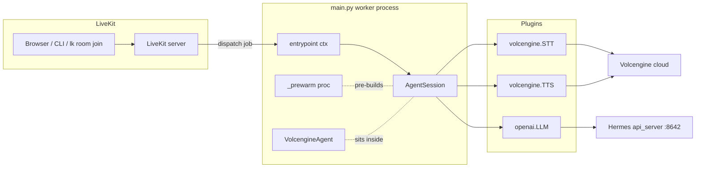

# Architecture Overview

OpenVox is a single Python process (`main.py`) that registers as a LiveKit Agents worker. When LiveKit dispatches a job to a room, the worker builds one `AgentSession` per job and joins the room. Each session runs an STT → LLM → TTS pipeline; see [Session wiring](./session-wiring.md) for the per-session factory.

## Components at a glance

`main.py` is the only entrypoint. `config.py` is imported once at module load and exposes a process-wide `Config` singleton consumed by `_build_session()`. `scripts/start.sh` is the wrapper that prepares environment variables and the IPC port (8081) before launching `python main.py start`.

## Worker lifecycle

1. **Module import (`main.py` top-level)**
   - Imports `config.get_config` and calls it once (`_cfg = get_config()`). Failures (`ConfigError`, missing `~/.openvox/config.json`) propagate immediately, which is why `scripts/start.sh` does an explicit JSON-validity check before launching.
   - Installs three monkey-patches before any `AgentSession` is created. See [Patches applied at import](#patches-applied-at-import).
   - Configures `logging.basicConfig` with `force=True` so LiveKit's CLI JSON handler cannot double-print.
2. **`WorkerOptions(agent_name=...)` registration** (`if __name__ == "__main__"`)
   - `prewarm_fnc=_prewarm` warms one `AgentSession` to amortize cold-start of STT/TTS/LLM on first dispatch.
   - `agent_name=_cfg.require("livekit.agent_name")` (currently `openz`, kept for the external app — see [Configuration → Config loader](../configuration/config-loader.md)).
3. **Per-job dispatch** (`async def entrypoint(ctx)`)
   - `_build_session()` constructs a fresh `AgentSession` per room.
   - `session.start(agent=VolcengineAgent(), room=ctx.room, room_input_options=RoomInputOptions(text_input_cb=_custom_text_input_cb))` joins the room and runs the pipeline.
   - The text-input callback overrides the framework default (which already does `sess.interrupt()` + `sess.generate_reply(user_input=ev.text)`) only to add `[文本]` Chinese log markers; semantics are preserved.

## Patches applied at import

All three are necessary, not optional, and live at the top of `main.py`:

1. **`openai.AsyncCompletions.create` filter** — `_FilterNoneChoices` wraps streamed chunks and drops `chunk.choices is None` frames. The Hermes gateway emits usage-only chunks when `stream_options.include_usage=True`; without this filter, `livekit-plugins-openai` would throw `TypeError` on the missing `choices`. See [Integrations → Hermes LLM](../integrations/hermes-llm.md).
2. **`livekit.agents.cli.log.setup_logging` no-op** — assigns `lambda *args, **kwargs: None` so the framework does not stack its JSON handler on top of the `basicConfig` we already installed. Without this, every log line prints twice.
3. **`volcengine.SpeechStream._process_stream_event` + `_run` patches** — two related patches on the vendored STT plugin:
   - The `_process_stream_event` wrap logs the final transcript via `[用户语音] <text>` for console observability. `logging.basicConfig` does not expand `extra={"text": ...}` automatically, so the patch reads the parsed payload directly.
   - The `_run` wrap swallows `asyncio.CancelledError` on shutdown. `livekit-agents 1.6.x` cancels the STT's internal `recv_task` when the child process tears down; the un-awaited `_GatheringFuture` then logs "exception was never retrieved" on every disconnect. The patch keeps the original `ws.close()` + `gracefully_cancel()` cleanup but returns silently on cancel.

## What `entrypoint` does and does not do

- Calls `_build_session()` per job (not just at prewarm time) so each room gets its own session and STT connection.
- Passes `_custom_text_input_cb` to `session.start(room_input_options=...)`. This is the `livekit-agents 1.5.x` / `1.6.x` contract — `RoomInputOptions` is **not** an `AgentSession.__init__` argument (that was the old 1.2.9 shape).
- Does **not** call `room.connect()` or manually subscribe to participants; `AgentSession` handles that internally.

## Where to look next

- Session wiring specifics (plugin classes, on_enter greeting) — [Architecture → Session wiring](./session-wiring.md).
- How config keys map to plugin kwargs — [Configuration → Config loader](../configuration/config-loader.md).
- Running, dispatching, and troubleshooting — [Operations → Local runbook](../operations/local-runbook.md).
- What each test contract enforces on this architecture — [Testing → Overview](../testing/overview.md).

## Source anchors

- `main.py` lines 1–154 (patches, logging setup, imports)
- `main.py` lines 156–211 (`VolcengineAgent`, `_custom_text_input_cb`)
- `main.py` lines 219–284 (`_prewarm`, `_build_session`, `entrypoint`, `WorkerOptions`)
- `config.py` lines 26–106 (`Config`, `get_config`, `reset_config`, `set_config`, `OPENVOX_CONFIG`)
- `scripts/start.sh` lines 31–53 (config existence + JSON sanity, exports `LIVEKIT_URL`/`API_KEY`/`API_SECRET`)
- `pyproject.toml` (dependency surface)