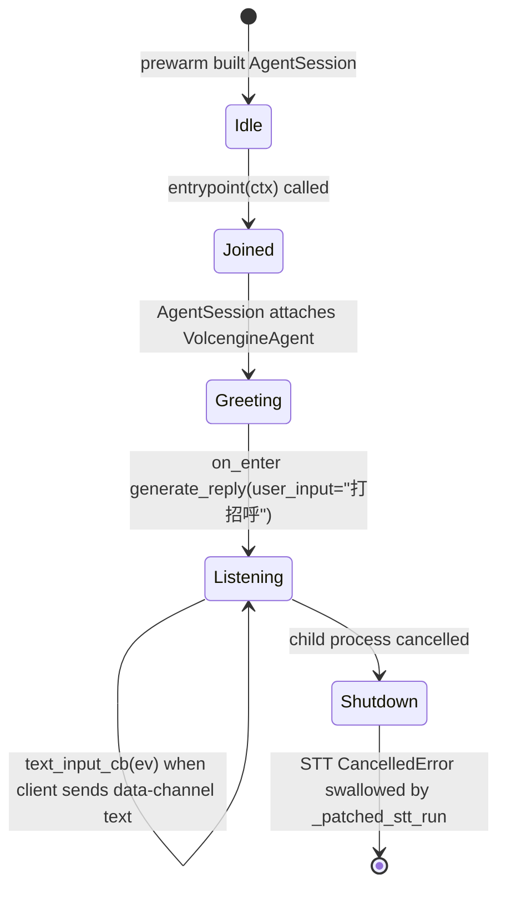

# Session Wiring

Each LiveKit dispatch runs in its own child process. `main._build_session()` constructs one `livekit.agents.AgentSession` per dispatch; `_prewarm()` runs once on worker boot to amortize plugin cold-start.

## `_build_session()` shape

```python
def _build_session() -> AgentSession:
    return AgentSession(
        stt=volcengine.STT(
            app_id=_cfg.require("volcengine.stt.app_id"),
            access_token=_cfg.require("volcengine.stt.access_token"),
        ),
        llm=openai.LLM(
            model=_cfg.require("hermes.model"),
            base_url=_cfg.require("hermes.api_base"),
            api_key=_cfg.require("hermes.api_key"),
        ),
        tts=volcengine.TTS(
            app_id=_cfg.require("volcengine.tts.app_id"),
            access_token=_cfg.require("volcengine.tts.access_token"),
        ),
    )
```

Three plugins, six config keys. STT/TTS come from the vendored [livekit-plugins-volcengine](../integrations/volcengine-plugin.md); LLM comes from `livekit-plugins-openai` (pinned to `==1.6.4` in `pyproject.toml`) and is redirected at the Hermes api_server rather than OpenAI; see [Integrations → Hermes LLM](../integrations/hermes-llm.md).

There is **no** `PIPELINE=` switch left in `main.py` — the previous `pipeline` / `qwen-realtime` / `volcengine-realtime` branches are gone. `tests/test_main_build_session.py::test_qwen_realtime_branch_removed`, `test_volcengine_realtime_branch_removed`, and `test_no_pipeline_module_constant` enforce this by static AST scan.

## `VolcengineAgent`

```python
class VolcengineAgent(Agent):
    def __init__(self, *, instructions: str | None = None) -> None:
        super().__init__(
            instructions=instructions or (
                "你是一个友好的中文语音助手，名字叫小语。"
                "请用简洁、自然的口吻回答用户的问题，"
                "避免使用表情符号、Markdown 或特殊符号。"
            ),
        )

    async def on_enter(self) -> None:
        logger.info("[Agent] 主动打招呼")
        await self.session.generate_reply(user_input="打招呼")
```

- Default persona is **小语**, a friendly Chinese voice assistant. Override at construction by passing `instructions=...`.
- `on_enter` is called once when the agent is attached to the room. It calls `session.generate_reply()` with an explicit `user_input="打招呼"` placeholder. **This is required, not optional**: see [Integrations → Hermes LLM](../integrations/hermes-llm.md) for why omitting `user_input` causes Hermes to 400 with `No user message found in messages`.
- The agent carries no function tools, MCP servers, persona files, skills, memory, or workspace bindings — those were removed in Task 2 (see `tests/test_volcengine_agent.py::test_no_agent_persona_import`, `test_no_build_agent_function`, `test_no_session_holder_module_global`, `test_no_workspace_root_in_entrypoint`).

## Text input callback

```python
def _custom_text_input_cb(sess: AgentSession, ev: TextInputEvent) -> None:
    logger.info(f"[文本] 收到客户端消息: {ev.text!r}")
    sess.interrupt()
    sess.generate_reply(user_input=ev.text)
    logger.info("[文本] 已将消息发送给 agent 触发回复")
```

The LiveKit framework already implements "interrupt + generate_reply" for DataChannel `TOPIC_CHAT` text; this override keeps the exact semantics and only adds `[文本]` Chinese log markers so the operator can see in the worker console what the user typed vs. what the STT heard. It is passed via `RoomInputOptions(text_input_cb=...)` to `session.start()`, **not** to `AgentSession.__init__()` (the latter is the obsolete 1.2.9 contract).

## Per-room lifecycle



The Listening→Listening loop is what the user spends 99% of the session in. `livekit-agents` owns the pipeline plumbing; OpenVox only customises the input callback and the on-enter greeting.

## What the tests pin

`tests/test_main_build_session.py` and `tests/test_volcengine_agent.py` together lock the public contract:

| Test | Enforces |
|------|----------|
| `test_pipeline_uses_openai_llm` | `openai.LLM` is constructed with `model`, `api_key`, `base_url` from `hermes.*`; no `extra_headers` (the bridge is gone) |
| `test_pipeline_uses_volcengine_stt_tts` | `volcengine.STT` / `TTS` are constructed with the `volcengine.{stt,tts}.{app_id,access_token}` keys |
| `test_qwen_realtime_branch_removed` | `main.py` source contains no `qwen` literal |
| `test_volcengine_realtime_branch_removed` | `main.py` source contains no `RealtimeModel` / `RealtimeSession` / `VOLCENGINE_REALTIME_*` |
| `test_does_not_load_dotenv` | `main.py` does not import `dotenv` or call `load_dotenv` (config is the single source of truth) |
| `test_no_pipeline_module_constant` | no module-level `PIPELINE = ...` / `PIPELINE: str = ...` |
| `test_agent_instructions_default` | default instructions include `小语` and contain no Markdown / emoji |
| `test_agent_instructions_override` | explicit `instructions=...` overrides the default |
| `test_on_enter_pipeline_calls_generate_reply` | `on_enter` calls `generate_reply(user_input=...)` with a non-empty string |
| `test_no_build_agent_function` | no top-level `build_agent()` |
| `test_no_agent_persona_import` | no `agent_persona` / `agent_skills` / `agent_extensions` / `agent_memory` imports |
| `test_no_session_holder_module_global` | no module-level `_session_holder` |
| `test_no_workspace_root_in_entrypoint` | `entrypoint()` body references neither `WORKSPACE_ROOT` nor `agent_memory` |

See [Testing → Overview](../testing/overview.md) for the full pytest layout.

## Source anchors

- `main.py` lines 156–211 (`VolcengineAgent`, `_custom_text_input_cb`)
- `main.py` lines 219–249 (`_prewarm`, `_build_session`)
- `main.py` lines 257–284 (`entrypoint`, `WorkerOptions`)
- `tests/test_main_build_session.py`, `tests/test_volcengine_agent.py`
- `docs/superpowers/specs/2026-07-09-remove-hermes-bridge-design.md` (history of how the LLM wiring converged on `openai.LLM` directly)