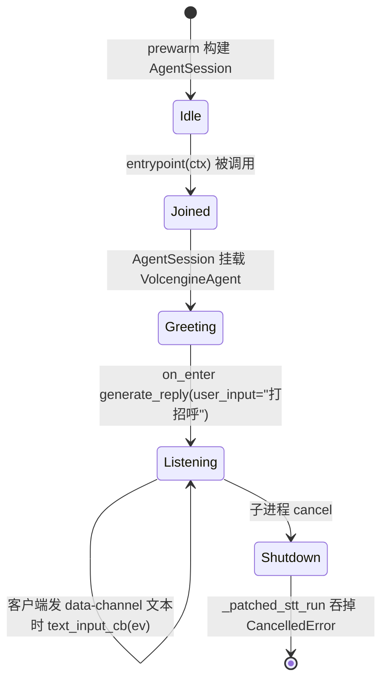

# 会话拼装

每个 LiveKit 派单跑在独立子进程里。`main._build_session()` 给每次派单构造一个 `livekit.agents.AgentSession`;`_prewarm()` 在 worker 启动时跑一次,摊薄插件冷启动。

## `_build_session()` 形状

```python
def _build_session() -> AgentSession:
    return AgentSession(
        stt=volcengine.STT(
            app_id=_cfg.require("volcengine.stt.app_id"),
            access_token=_cfg.require("volcengine.stt.access_token"),
        ),
        llm=openai.LLM(
            model=_cfg.require("hermes.model"),
            base_url=_cfg.require("hermes.api_base"),
            api_key=_cfg.require("hermes.api_key"),
        ),
        tts=volcengine.TTS(
            app_id=_cfg.require("volcengine.tts.app_id"),
            access_token=_cfg.require("volcengine.tts.access_token"),
        ),
    )
```

三插件、六配置键。STT/TTS 来自 vendored [livekit-plugins-volcengine](../integrations/volcengine-plugin.md);LLM 来自 `livekit-plugins-openai`(`pyproject.toml` 里钉 `==1.6.4`),目标地址是 Hermes api_server 而不是 OpenAI。

`main.py` 里**没有** `PIPELINE=` 分支了 —— 之前的 `pipeline` / `qwen-realtime` / `volcengine-realtime` 分支都已删掉。`tests/test_main_build_session.py::test_qwen_realtime_branch_removed`、`test_volcengine_realtime_branch_removed`、`test_no_pipeline_module_constant` 通过静态 AST 扫描锁住这一点。

## `VolcengineAgent`

```python
class VolcengineAgent(Agent):
    def __init__(self, *, instructions: str | None = None) -> None:
        super().__init__(
            instructions=instructions or (
                "你是一个友好的中文语音助手,名字叫小语。"
                "请用简洁、自然的口吻回答用户的问题,"
                "避免使用表情符号、Markdown 或特殊符号。"
            ),
        )

    async def on_enter(self) -> None:
        logger.info("[Agent] 主动打招呼")
        await self.session.generate_reply(user_input="打招呼")
```

- 默认 persona 是 **小语**,一个友好的中文语音助手。构造时显式传 `instructions=...` 可覆盖默认。
- `on_enter` 在 agent 接入房间时调用一次。它显式调 `session.generate_reply(user_input="打招呼")`。**这是必需,不是可选**:Hermes api_server 严格要求 `chat.messages` 里至少一条 `user` role 的消息;省略 `user_input` 会让 Hermes 返回 `400 No user message found in messages`。`livekit-agents 1.6.x` 的 `_pipeline_reply_task_impl` 只在 `new_message is not None` 时往 `chat_ctx.insert(user_message)`,所以无 `user_input` 的 `generate_reply()` 等价于发空 messages 请求。
- agent 不带 function tools、MCP servers、persona 文件、skills、memory、workspace 绑定 —— 这些都在重构中移除(`tests/test_volcengine_agent.py::test_no_agent_persona_import`、`test_no_build_agent_function`、`test_no_session_holder_module_global`、`test_no_workspace_root_in_entrypoint`)。

## 文本输入回调

```python
def _custom_text_input_cb(sess: AgentSession, ev: TextInputEvent) -> None:
    logger.info(f"[文本] 收到客户端消息: {ev.text!r}")
    sess.interrupt()
    sess.generate_reply(user_input=ev.text)
    logger.info("[文本] 已将消息发送给 agent 触发回复")
```

LiveKit 框架对 DataChannel `TOPIC_CHAT` 文本已经有 "interrupt + generate_reply" 默认实现;这里覆盖完全保留语义,只加上 `[文本]` 中文日志 marker,让运维在 worker 控制台能看到"用户键入的文本"与"STT 听到的文本"两路来源。回调通过 `RoomInputOptions(text_input_cb=...)` 传给 `session.start()`,**不**传给 `AgentSession.__init__()`(后者是过时的 1.2.9 契约)。

## 逐房间生命周期



Listening → Listening 循环占 99% 的会话时长。`livekit-agents` 拥有流水线管路,OpenVox 只定制输入回调和 on_enter 问候。

## 测试在锁什么

`tests/test_main_build_session.py` 和 `tests/test_volcengine_agent.py` 一起锁住公共契约:

| 测试 | 锁的内容 |
|------|----------|
| `test_pipeline_uses_openai_llm` | `openai.LLM` 用 `model` / `api_key` / `base_url` 从 `hermes.*` 构造;没有 `extra_headers`(bridge 移除) |
| `test_pipeline_uses_volcengine_stt_tts` | `volcengine.STT` / `TTS` 用 `volcengine.{stt,tts}.{app_id,access_token}` 键构造 |
| `test_qwen_realtime_branch_removed` | `main.py` 源码不包含 `qwen` 字面量 |
| `test_volcengine_realtime_branch_removed` | `main.py` 源码不包含 `RealtimeModel` / `RealtimeSession` / `VOLCENGINE_REALTIME_*` |
| `test_does_not_load_dotenv` | `main.py` 不 import `dotenv` 也不调 `load_dotenv`(config 是单一信源) |
| `test_no_pipeline_module_constant` | 无模块级 `PIPELINE = ...` / `PIPELINE: str = ...` |
| `test_agent_instructions_default` | 默认 instructions 含 `小语`、不含 Markdown / emoji |
| `test_agent_instructions_override` | 显式 `instructions=...` 覆盖默认 |
| `test_on_enter_pipeline_calls_generate_reply` | `on_enter` 调 `generate_reply(user_input=...)` 且非空字符串 |
| `test_no_build_agent_function` | 无顶层 `build_agent()` |
| `test_no_agent_persona_import` | 无 `agent_persona` / `agent_skills` / `agent_extensions` / `agent_memory` import |
| `test_no_session_holder_module_global` | 无模块级 `_session_holder` |
| `test_no_workspace_root_in_entrypoint` | `entrypoint()` 函数体不引用 `WORKSPACE_ROOT` 也不引用 `agent_memory` |

## Source anchors

- `apps/voice-agent/main.py` 行 217–264(`VolcengineAgent`、`_custom_text_input_cb`)
- `apps/voice-agent/main.py` 行 273–302(`_prewarm`、`_build_session`)
- `apps/voice-agent/main.py` 行 310–379(`entrypoint`、`WorkerOptions`)
- `apps/voice-agent/tests/test_main_build_session.py`、`apps/voice-agent/tests/test_volcengine_agent.py`
- `apps/voice-agent/docs/superpowers/specs/2026-07-09-rename-to-openvox-design.md`(为什么 `agent_name` 暂时仍是 `openz`)