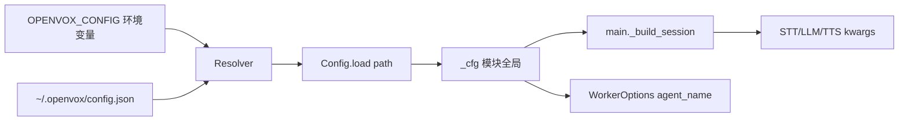

# Config Loader

`apps/voice-agent/config.py` 是一个 100 行、无第三方依赖的 JSON loader。**唯一**配置源是 `~/.openvox/config.json`,**唯一**环境变量覆盖项是 `OPENVOX_CONFIG`(给测试用)。`main.py` 已经不读 `.env`(`tests/test_main_build_session.py::test_does_not_load_dotenv` 锁住)。

## `Config` 做什么

`Config` 是 `dict[str, Any]` 的只读包装,提供两种访问方法:

- `cfg.get(dotted_key, default=None)` — 路径任意一段缺失就返回 `default`。**永远不会抛异常。**
- `cfg.require(dotted_key)` — 路径任意一段缺失抛 `ConfigError`(继承自 `RuntimeError`)。`main.py` 的固定写法是对"worker 没它就跑不起来"的键使用 `require(...)`。

路径段以 `.` 切分,例如 `_cfg.require("volcengine.stt.app_id")`。

## 单例生命周期

- `get_config()` 第一次调用时读 `~/.openvox/config.json`(若设置了 `$OPENVOX_CONFIG` 则读那个),结果缓存到模块全局 `_cfg`。后续调用直接返回同一个实例。
- `set_config(cfg)` 仅供测试,绕过文件读。`tests/test_config.py::test_set_and_get_config` 覆盖它。
- `reset_config()` 清空缓存,下一次 `get_config()` 会重新读盘。用于在不同测试用例之间切换 `OPENVOX_CONFIG`。
- `main.py` 在模块 import 时调用一次 `get_config()`。`scripts/start.sh` 启动前用 `python -c "import json; json.load(open(sys.argv[1]))"` 显式做 JSON 合法性预检,这样格式错误能在 worker 加载前就大声失败,而不是在日志里慢慢显示 import error。

## Schema

`main._build_session()` 和 `WorkerOptions` 当前消费的键:

```jsonc
{
  "livekit": {
    "url": "ws://localhost:7880",          // 同时被 LiveKit SDK 作为 LIVEKIT_URL
    "api_key": "devkey",                   // LIVEKIT_API_KEY
    "api_secret": "secret",                // LIVEKIT_API_SECRET
    "agent_name": "openz"                  // 与 lk dispatch create --agent-name 一致
  },
  "volcengine": {
    "stt": {
      "app_id": "1605412251",
      "access_token": "..."
    },
    "tts": {
      "app_id": "1605412251",
      "access_token": "..."
    }
  },
  "hermes": {
    "model": "hermes-agent",
    "api_base": "http://127.0.0.1:8642/v1",
    "api_key": "livekit-bridge-test"
  }
}
```

注意 `livekit.agent_name` 故意仍是 `"openz"`,因为外部 app 还在用 `lk dispatch create --agent-name openz` 派单。`docs/superpowers/specs/2026-07-09-rename-to-openvox-design.md` 记录了这个决定;等 app 侧迁移后再统一改成 `openvox`。`lk dispatch create --agent-name` 必须始终等于这个值,否则 worker 永远收不到 job。

## loader 如何接进运行时



`scripts/start.sh` 从 `livekit.url` / `api_key` / `api_secret` 读出并 export 为 `LIVEKIT_URL` / `LIVEKIT_API_KEY` / `LIVEKIT_API_SECRET`。LiveKit SDK 直接走 `os.environ` 查这些,**不**走 `Config`;export 就是桥。

## 新增键的流程

1. 在 `~/.openvox/config.json` 的相应业务段下加 sub-key(`volcengine` / `livekit` / `hermes` 是已有的)。
2. 在 `main.py` 通过 `_cfg.require("section.new_key")` 读(可选则用 `_cfg.get("...", default=...)`)。
3. 在 `tests/test_main_build_session.py`(或新建测试文件)注入含新键的 `Config(...)`,断言插件 / 选项拿到正确值。
4. `Config` 类本身不需要改 —— 点路径解析器支持任意嵌套(见 `test_get_nested_key` 和 `test_require_raises_for_partial_nested_missing`)。

## 已知坑

- 路径拼写错(如 `_cfg.require("volcengine.stt.appid")`)会在模块 import 时抛 `ConfigError("missing required config key: volcengine.stt.appid")`,`scripts/start.sh` **不会**预检这条;只有 worker 启动日志会看到。建议在 REPL 用 `as_dict()` 读出原始字典,把 loader 实际生成的路径抄过去再 require。
- `Config.load` 拒绝非 object 根(如 `[1, 2, 3]`)和坏 JSON。两者都抛 `ConfigError` 而不是 `json.JSONDecodeError`。`tests/test_config.py::test_load_raises_for_bad_json` 和 `test_load_raises_for_non_object_root` 锁住这点。
- 不要在生产环境把 `OPENVOX_CONFIG` 指向非 JSON 文件;测试依赖它就是合法 JSON object。

## Source anchors

- `apps/voice-agent/config.py` 行 26–106(整个模块)
- `apps/voice-agent/main.py` 行 108(`_cfg = get_config()`)
- `apps/voice-agent/main.py` 行 282–302(`_build_session` 通过 `_cfg.require` 读 6 个键)
- `apps/voice-agent/main.py` 行 377(`agent_name=_cfg.require("livekit.agent_name")`)
- `apps/voice-agent/scripts/start.sh` 行 31–53(config 存在性 + JSON 合法性 + 导出 `LIVEKIT_*`)
- `apps/voice-agent/tests/test_config.py`(`Config` / `get_config` / `set_config` / `reset_config` 全覆盖)
- `apps/voice-agent/tests/test_main_build_session.py::_make_fake_config`(其他测试用的标准 fake config)