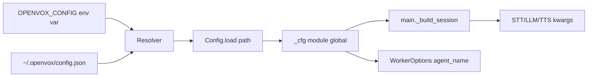

# Config Loader

`config.py` is a 100-line, dependency-free JSON loader. There is exactly one config file (`~/.openvox/config.json`) and one env override (`OPENVOX_CONFIG`) for tests. `.env` is no longer read by `main.py` (`tests/test_main_build_session.py::test_does_not_load_dotenv` enforces this).

## What `Config` does

`Config` is a thin read-only wrapper around a `dict[str, Any]` with two access methods:

- `cfg.get(dotted_key, default=None)` — returns `default` if any segment of the path is missing. **Never** raises.
- `cfg.require(dotted_key)` — raises `ConfigError` (a `RuntimeError` subclass) on any missing segment. The pattern in `main.py` is always `require(...)` for keys the worker cannot run without.

Path segments are split on `.`, e.g. `_cfg.require("volcengine.stt.app_id")`.

## Singleton lifecycle

- `get_config()` reads `~/.openvox/config.json` (or `$OPENVOX_CONFIG` if set) on first call and caches the result in the module-global `_cfg`. Subsequent calls return the same instance.
- `set_config(cfg)` is test-only and bypasses the file. `tests/test_config.py::test_set_and_get_config` exercises it.
- `reset_config()` clears the cache so the next `get_config()` re-reads from disk. Used in tests that want to switch `OPENVOX_CONFIG` between calls.
- `main.py` calls `get_config()` once at module import time. `scripts/start.sh` does an explicit JSON-validity pre-check via `python -c "import json; json.load(open(sys.argv[1]))"` so a malformed config fails loudly before the worker even loads.

## Schema

The keys currently consumed by `main._build_session()` and `WorkerOptions`:

```jsonc
{
  "livekit": {
    "url": "ws://localhost:7880",          // also used by LiveKit SDK as LIVEKIT_URL
    "api_key": "devkey",                   // LIVEKIT_API_KEY
    "api_secret": "secret",                // LIVEKIT_API_SECRET
    "agent_name": "openz"                  // matches lk dispatch create --agent-name
  },
  "volcengine": {
    "stt": {
      "app_id": "1605412251",
      "access_token": "..."
    },
    "tts": {
      "app_id": "1605412251",
      "access_token": "..."
    }
  },
  "hermes": {
    "model": "hermes-agent",
    "api_base": "http://127.0.0.1:8642/v1",
    "api_key": "livekit-bridge-test"
  }
}
```

Note: `livekit.agent_name` is intentionally still `"openz"` while the external app dispatches with `lk dispatch create --agent-name openz`. `docs/superpowers/specs/2026-07-09-rename-to-openvox-design.md` records the decision; the value should change once the app side migrates. The `lk dispatch create --agent-name` flag must always match this value, otherwise the worker never receives the job.

## How the loader ties into runtime



`scripts/start.sh` reads `livekit.url` / `api_key` / `api_secret` and exports them as `LIVEKIT_URL`, `LIVEKIT_API_KEY`, `LIVEKIT_API_SECRET`. The LiveKit SDK looks these up directly from `os.environ`, not from `Config`; the export is the bridge.

## Adding a new key

1. Add the segment under the appropriate business section in `~/.openvox/config.json` (`volcengine`, `livekit`, `hermes` are the existing ones).
2. Read it in `main.py` via `_cfg.require("section.new_key")` (or `_cfg.get("...", default=...)` if optional).
3. Add a test in `tests/test_main_build_session.py` (or write a new test file) that injects a `Config(...)` with the new key and asserts the plugin / option picks it up.
4. The `Config` class itself does not need changes — its dot-path resolver handles arbitrary nesting (see `test_get_nested_key` and `test_require_raises_for_partial_nested_missing`).

## Pitfalls

- A typo in a segment, e.g. `_cfg.require("volcengine.stt.appid")`, raises `ConfigError("missing required config key: volcengine.stt.appid")` at module import — `scripts/start.sh` will not catch this; only the worker startup log will. Use the exact path the loader produces when reading `as_dict()` in a REPL to confirm.
- `Config.load` rejects non-object roots (`[1, 2, 3]`) and malformed JSON. Both raise `ConfigError`, not `json.JSONDecodeError`. `tests/test_config.py::test_load_raises_for_bad_json` and `test_load_raises_for_non_object_root` lock this.
- Do not point `OPENVOX_CONFIG` at a non-JSON file in production; tests rely on this being a real JSON object.

## Source anchors

- `config.py` lines 26–106 (whole module)
- `main.py` line 75 (`_cfg = get_config()`)
- `main.py` lines 235–248 (`_build_session` reading six keys via `_cfg.require`)
- `main.py` line 283 (`agent_name=_cfg.require("livekit.agent_name")`)
- `scripts/start.sh` lines 31–53 (config existence + JSON sanity + env export)
- `tests/test_config.py` (full coverage of `Config` / `get_config` / `set_config` / `reset_config`)
- `tests/test_main_build_session.py::_make_fake_config` (canonical fake config used by other tests)