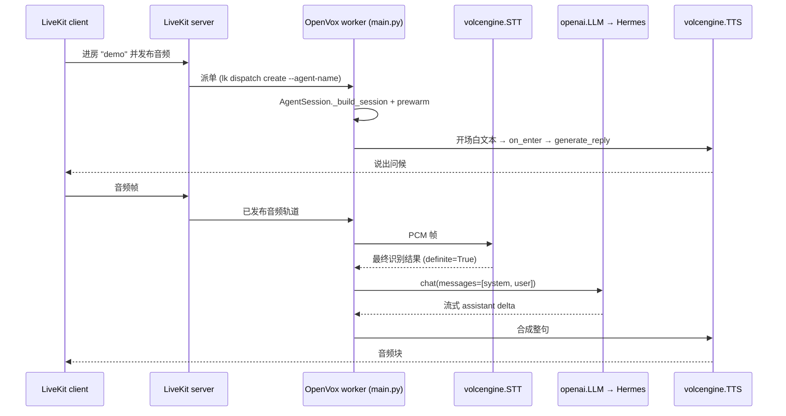

# OpenVox 入门

OpenVox 是一个 [LiveKit Agents](https://github.com/livekit/agents) worker,在 LiveKit 房间内跑一个中文语音助手:音频从房间录制 → Volcengine STT 转写 → 本地 [Hermes](https://github.com/) OpenAI-兼容网关 → Volcengine TTS 播回房间。

整套流水线都写在 `apps/voice-agent/main.py`,由 `_build_session()` 拼装。当前只剩一种 pipeline 模式(`pipeline`),历史上曾经存在的 `realtime` / `qwen-realtime` 变体都已移除,见 [架构 → 会话拼装](./architecture/session-wiring.md)。

## 助手怎么说话



## 下一步看哪里

- [架构 → 总览](./architecture/overview.md) — 运行时流程、worker 生命周期、模块加载时安装的三处 monkey-patch。
- [架构 → 会话拼装](./architecture/session-wiring.md) — `_build_session()`、`VolcengineAgent`,以及触发 `generate_reply(user_input="打招呼")` 的 `on_enter`。
- [架构 → 跨端契约](./architecture/contracts.md) — `shared/` 目录的命名约定、Participant Metadata 字段、Access Token Claims 模板。
- [配置 → Config loader](./configuration/config-loader.md) — `~/.openvox/config.json` schema、`OPENVOX_CONFIG` 覆盖项、单例缓存。
- [运维 → 本地 Runbook](./operations/local-runbook.md) — 三终端启动、`lk dispatch create`、IPC 端口 8081、故障排查表。
- [集成 → Volcengine 插件](./integrations/volcengine-plugin.md) — vendored `livekit-plugins-volcengine`(STT/TTS/LLM/Realtime)、keyword-only kwargs、`--no-deps` 的 editable 安装。
- [已知坑索引](#已知坑索引) — 指向 `apps/voice-agent/CLAUDE.md` 「已知坑」章节的导航,**细节不复述**。

## Source Map(速查)

| 路径 | 角色 |
|------|------|
| `apps/voice-agent/main.py` | Worker 入口;`VolcengineAgent`、`_build_session`、`_prewarm`、monkey-patch |
| `apps/voice-agent/config.py` | `~/.openvox/config.json` loader,带点路径 `require` / `get` |
| `apps/voice-agent/pyproject.toml` | 声明 `livekit-agents[otel,silero,turn-detector]~=1.5`、`livekit-plugins-volcengine`、`livekit-plugins-openai==1.6.4` |
| `apps/voice-agent/scripts/start.sh` | 校验 config、导出 `LIVEKIT_URL` / `LIVEKIT_API_KEY` / `LIVEKIT_API_SECRET` 环境变量、`python main.py start`(启动前杀掉残留 8081 进程) |
| `apps/voice-agent/scripts/run_tests.sh` | `unit` / `e2e` / `full` 三档 pytest |
| `apps/voice-agent/plugins/livekit-plugins-volcengine/` | vendored Volcengine 插件(STT、TTS、LLM、RealtimeModel) |
| `apps/voice-agent/plugins/livekit-plugins-qwen/` | 旧版 Qwen Realtime 插件,目录保留但未引用 |
| `apps/voice-agent/tests/` | pytest 套件 + `tests/fixtures/audio/` wav 输入 |
| `apps/voice-agent/docs/superpowers/specs/` | 改名、Hermes-bridge 移除等设计笔记 |
| `shared/agent-protocol.md`、`shared/room-naming.md`、`shared/livekit-claims.example.json` | 跨端契约源头,详见 [跨端契约](./architecture/contracts.md) |
| `.github/workflows/openwiki-update.yml` | 定时刷新 OpenWiki(`cron: 0 8 * * *`) |
| `apps/voice-agent/CLAUDE.md`、`apps/voice-agent/README.md` | 已有中文操作手册 + agent 文档,**OpenWiki 不复述** |

## 一键起

```bash
# 一次性
python3.11 -m venv .venv && source .venv/bin/activate
pip install "livekit-agents[otel,silero,turn-detector]~=1.5" python-dotenv
pip install -e ./apps/voice-agent/plugins/livekit-plugins-volcengine --no-deps
mkdir -p ~/.openvox && cat > ~/.openvox/config.json <<'JSON'
{
  "livekit": {
    "url": "ws://localhost:7880",
    "api_key": "devkey",
    "api_secret": "secret",
    "agent_name": "openz"
  },
  "volcengine": {
    "stt": {"app_id": "...", "access_token": "..."},
    "tts": {"app_id": "...", "access_token": "..."}
  },
  "hermes": {
    "api_base": "http://127.0.0.1:8642/v1",
    "api_key": "...",
    "model": "hermes-agent"
  }
}
JSON

# 三终端启动
./apps/voice-agent/scripts/start.sh                                  # B:worker(杀掉残留 8081,启动 python main.py start)
docker start voice-assistant-livekit-1                              # A:LiveKit server(macOS 开发机上已在跑)
lk dispatch create --dev --room demo --agent-name openz              # C:派单
lk token create --dev --room demo --identity alice --join            # C:客户端 token
```

完整流程与故障排查见 [运维 → 本地 Runbook](./operations/local-runbook.md)。

## 已知坑索引

> OpenWiki **不复述**这些坑的细节,只列出入口与一句话解释。完整原因与解决方案见 `apps/voice-agent/CLAUDE.md` 的「已知坑」章节。

- `editable install` **必须**带 `--no-deps` —— 否则 pip 会把 `livekit-agents` 降到 1.5.4,搞坏 `[otel,silero,turn-detector]` extras。
- `prewarm_fnc` 必须是模块级函数(`def _prewarm(proc): ...`)—— lambda 跨 IPC pickle 会抛 `PicklingError`。
- Worker IPC 端口是 `8081` —— 崩溃残留会让下次 `start` 报 `address already in use`;`scripts/start.sh` 会先 `lsof -ti:8081 | xargs kill -9`。
- `lk dispatch create --agent-name` **必须**匹配 `~/.openvox/config.json` 里的 `livekit.agent_name`(目前仍是 `openz`,因为外部 app 还没改名)。
- Hermes api_server 要求 `chat.messages` 里至少有一条 `user` 消息 —— `VolcengineAgent.on_enter` 通过 `user_input="打招呼"` 触发 `generate_reply()` 来满足这条约束。
- Volcengine STT AppID 必须在控制台开通「流式语音识别 大模型」,否则 STT WebSocket 会返回 403。

## Backlog

| 区域 | 源锚 | 延期原因 |
|------|------|----------|
| Docker 打包(`Dockerfile`、`docker-compose.yml`、`start-lan.sh`、`start-emu.sh`、`livekit.yaml`) | `apps/voice-agent/CLAUDE.md` 提及 | 当前 worktree 中未提交;等打包落地再补 |
| Function tools / MCP / persona / skills / memory | `apps/voice-agent/docs/agent-capabilities-extension.md` | 这些能力已在重构中移除(`tests/test_volcengine_agent.py::test_no_agent_persona_import` 等锁住) |
| Qwen Realtime 插件(`plugins/livekit-plugins-qwen/`) | 目录存在但未 import | `tests/test_main_build_session.py::test_qwen_realtime_branch_removed` 锁住"未使用"状态 |
| LiveKit Cloud / 生产部署 | `apps/voice-agent/README.md` §7 | 仓库内暂无生产部署产物 |