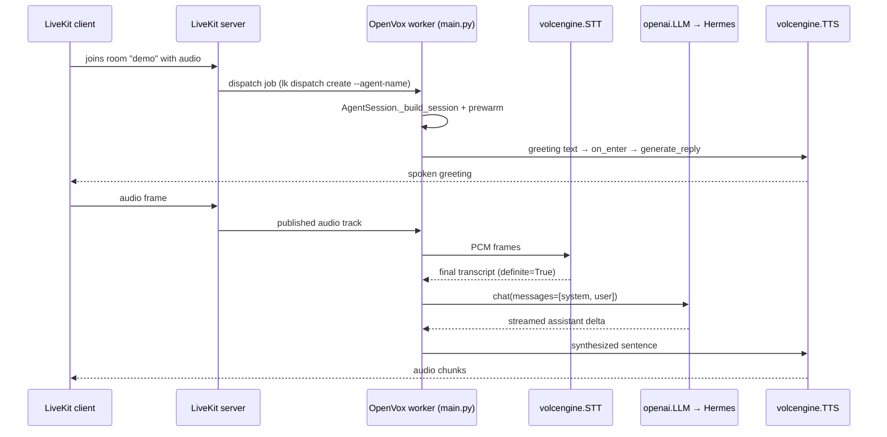

# OpenVox Quickstart

OpenVox is a [LiveKit Agents](https://github.com/livekit/agents) worker that runs a Chinese-language voice assistant in a LiveKit room. Audio is captured from the room, transcribed by Volcengine's STT, sent to a local [Hermes](https://github.com/...) OpenAI-compatible gateway, then spoken back through Volcengine's TTS.

The whole pipeline lives in `main.py` and is wired up in `_build_session()`. There is exactly one pipeline mode (`pipeline`); the previous `realtime` / `qwen-realtime` variants have been removed (see [Architecture → Session wiring](./architecture/session-wiring.md)).

## How the assistant speaks



## Where to go next

- [Architecture → Overview](./architecture/overview.md) — runtime flow, worker lifecycle, the three monkey-patches applied at module import.
- [Architecture → Session wiring](./architecture/session-wiring.md) — `_build_session()`, `VolcengineAgent`, and the on-enter greeting that triggers `generate_reply(user_input="打招呼")`.
- [Configuration → Config loader](./configuration/config-loader.md) — `~/.openvox/config.json` schema, `OPENVOX_CONFIG` override, singleton cache.
- [Operations → Local runbook](./operations/local-runbook.md) — three-terminal start, `lk dispatch create`, IPC port 8081, troubleshooting table.
- [Integrations → Volcengine plugin](./integrations/volcengine-plugin.md) — vendored `livekit-plugins-volcengine` (STT/TTS/LLM/Realtime), keyword-only kwargs, editable install with `--no-deps`.
- [Integrations → Hermes LLM](./integrations/hermes-llm.md) — `openai.LLM` over the Hermes api_server, the `_FilterNoneChoices` patch for usage-only chunks, and the user-message injection requirement.
- [Testing → Overview](./testing/overview.md) — pytest layout, fake-config fixtures, what each test contract enforces.

## Source map at a glance

| Path | Role |
|------|------|
| `main.py` | Worker entry; `VolcengineAgent`, `_build_session`, `_prewarm`, monkey-patches |
| `config.py` | `~/.openvox/config.json` loader with dot-path `require`/`get` |
| `pyproject.toml` | Declares `livekit-agents[otel,silero,turn-detector]~=1.5`, `livekit-plugins-volcengine`, `livekit-plugins-openai==1.6.4` |
| `scripts/start.sh` | Validates config, exports `LIVEKIT_URL`/`LIVEKIT_API_KEY`/`LIVEKIT_API_SECRET` env, launches `python main.py start` (kills stale 8081 first) |
| `scripts/run_tests.sh` | `unit` / `e2e` / `full` modes for pytest |
| `plugins/livekit-plugins-volcengine/` | Vendored Volcengine plugin (STT, TTS, LLM, RealtimeModel) |
| `plugins/livekit-plugins-qwen/` | Legacy Qwen Realtime plugin — present but unused |
| `tests/` | pytest suite + `tests/fixtures/audio/` wav inputs |
| `docs/agent-capabilities-extension.md` | Historical reference for Function Tools / MCP / hooks (capabilities were later removed) |
| `docs/superpowers/specs/` | Design notes for the rename and Hermes-bridge removal |
| `.github/workflows/openwiki-update.yml` | Scheduled OpenWiki refresh (`cron: 0 8 * * *`) |
| `CLAUDE.md`, `README.md` | Existing Chinese-language operator + agent docs |

## Quick run

```bash
# One-time
python3.11 -m venv .venv && source .venv/bin/activate
pip install "livekit-agents[otel,silero,turn-detector]~=1.5" python-dotenv
pip install -e ./plugins/livekit-plugins-volcengine --no-deps
echo '{"livekit":{"url":"ws://localhost:7880","api_key":"devkey","api_secret":"secret","agent_name":"openz"},"volcengine":{"stt":{"app_id":"...","access_token":"..."},"tts":{"app_id":"...","access_token":"..."}},"hermes":{"api_base":"http://127.0.0.1:8642/v1","api_key":"...","model":"hermes-agent"}}' > ~/.openvox/config.json

# Three-terminal start
./scripts/start.sh                    # B: worker (kills stale 8081, launches python main.py start)
docker start voice-assistant-livekit-1   # A: LiveKit server (already running on macOS dev machine)
lk dispatch create --dev --room demo --agent-name openz   # C: dispatch
lk token create --dev --room demo --identity alice --join # C: client token
```

See [Operations → Local runbook](./operations/local-runbook.md) for the full sequence and a troubleshooting table.

## Known pitfalls (carry over from `CLAUDE.md`)

- The editable install **must** pass `--no-deps` or pip will downgrade `livekit-agents` to 1.5.4 and break the `[otel,silero,turn-detector]` extras.
- `prewarm_fnc` must be a module-level function (`def _prewarm(proc): ...`); lambdas will throw `PicklingError` across the IPC boundary.
- The worker IPC port is `8081`. A crashed worker leaves the port held; `scripts/start.sh` calls `lsof -ti:8081 | xargs kill -9` before relaunching.
- `lk dispatch create --agent-name` **must** match the worker's `livekit.agent_name` from `~/.openvox/config.json` (currently kept as `openz` while the external app still uses that name — see [Configuration → Config loader](./configuration/config-loader.md)).
- The Hermes api_server requires at least one `user` message in `chat.messages`. `VolcengineAgent.on_enter` passes `user_input="打招呼"` to `generate_reply()` to satisfy this; see [Integrations → Hermes LLM](./integrations/hermes-llm.md).
- The Volcengine STT AppID must have "流式语音识别 大模型" enabled in the Volcengine console, otherwise the STT WebSocket returns 403.

## Backlog

| Area | Source anchor | Why deferred |
|------|---------------|--------------|
| Docker packaging (`Dockerfile`, `docker-compose.yml`, `start-lan.sh`, `start-emu.sh`, `livekit.yaml`) | referenced in `CLAUDE.md` | Not present in this worktree; tracked as out of scope until packaging lands. |
| Function tools / MCP / persona / skills / memory | `docs/agent-capabilities-extension.md` | Capabilities were intentionally removed from `VolcengineAgent` (Task 2). Document is historical reference only; `tests/test_volcengine_agent.py::test_no_agent_persona_import` and friends lock the simplified shape. |
| Qwen Realtime plugin (`plugins/livekit-plugins-qwen/`) | directory present | Not imported by `main.py`; `tests/test_main_build_session.py::test_qwen_realtime_branch_removed` enforces the absence. Keep as legacy. |
| LiveKit Cloud / production deployment | `README.md` §7 | No production deployment artefacts in repo yet. |